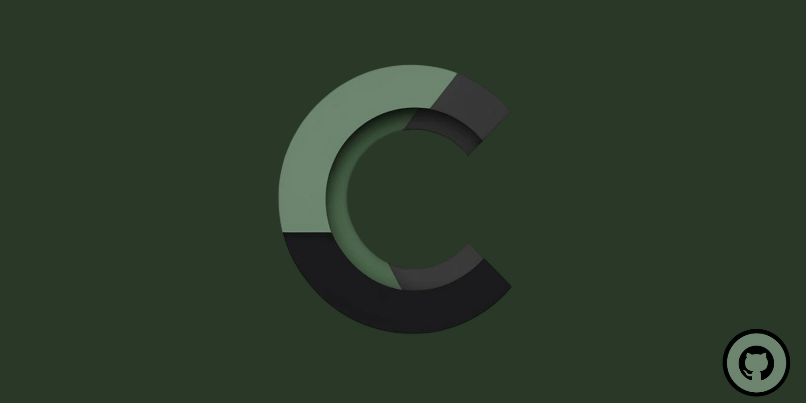
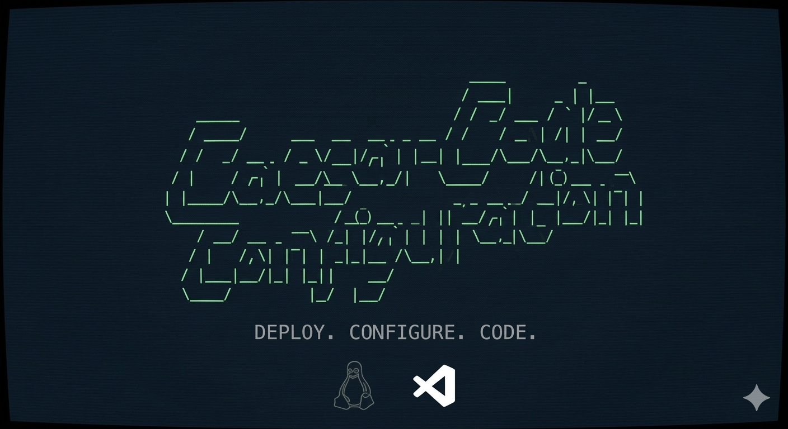

---

---

  

---

## 🔴 About Me

✨ **Github Star** 
💻 **Full Stack Developer**  

  
  

---

## 🔴 Skills & Technologies

| **Skills** | Most Used Languages |
|---------------------------------------------------------------------------------------------------------|---------------------------------------------------------------------------------------------------------|
| **Languages**:          **Frontend**:           **Backend & Databases**:         **Tools & Security**:         |  |

---
---

## 🔴 Projects
<table>  
  <tr>  
    <td width="33%" valign="top">  
      <h3 align="center">BergamotaRoutes</h3>  
      
  
          
        
  
            
            
        
  
        
Route optimization for drivers, integrated with APIs and developed in Next.js. Includes real-time data validation and management.
  
      
  
    </td>
    <td width="33%" valign="top">  
      <h3 align="center">QR Code Generator</h3>  
      
  
          
        
  
            
            
        
  
        
QR Code generator tool integrated with customizable URL input, developed in Python. Features real-time generation with adjustable size and PNG output.
  
      
        
    </td> 
    <td width="33%" valign="top">  
      <h3 align="center">COCOMO Calculator</h3>  
      
  
          
        
  
            
            
        
  
        
Interactive web tool for estimating software project effort and time using the COCOMO II model. Perfect for developers and project managers.
  
      

    </td>
  </tr>

  <tr>  
    <td width="33%" valign="top">  
      <h3 align="center">Enigma-EPS32</h3>  
      
  
          
        
  
            
        
  
        
Secure communication system implementing the Enigma cipher on ESP32. Encrypts via Bluetooth and forwards decrypted messages to Telegram via Wi-Fi.
  
      
        
    </td> 
    <td width="33%" valign="top">  
      <h3 align="center">ASTRA Compiler</h3>  
      
  
          
        
  
            
        
  
        
Modular compiler infrastructure in Python featuring lexical, syntactic, and semantic analysis with an AST optimization engine.
  
      
  
    </td>
    <td width="33%" valign="top">  
      <h3 align="center">CaesarCode Config</h3>  
      
  
          
        
  
            
        
  
        
Ultimate automated Linux setup. High-performance terminal configuration (Zsh, P10k, LSD) and seamless VS Code synchronization.
  
      
        
    </td>   
  </tr>

  <tr>
    <td width="33%" valign="top">  
      <h3 align="center">Sequence Digital</h3>  
      
  
          
        
  
            
        
  
        
Multiplayer board game engine developed in Godot 4. Features authoritative server logic, real-time synchronization, and clean minimalist UI.
  
      
  
    </td>
    <td width="33%" valign="top"></td>
    <td width="33%" valign="top"></td>
  </tr>
</table>

---

